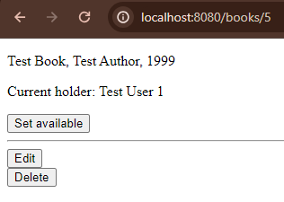
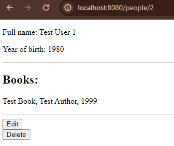
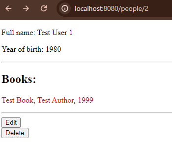

# Библиотека
CRUD Web приложение, представляющее собой модель модель библиотеки. Есть страница с книгами и страница с клиентами.
Людей и книги можно добавлять, просматривать, изменять, удалять. Человек может брать книги на определенный срок, а 
когда срок выходит, название книги на его странице окрашивается в красный.

Страница книги:\

Страница человека:\

Страница человека с просроченной книгой:\
